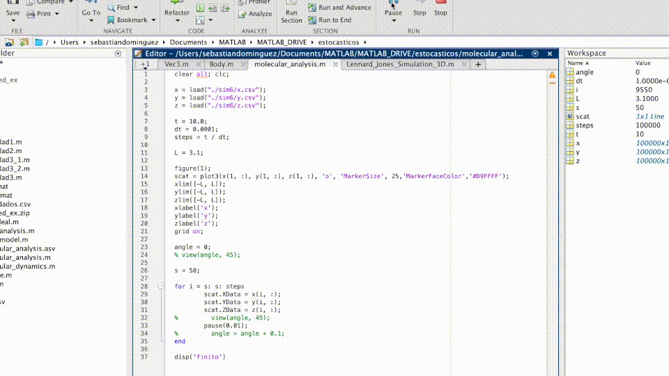

# Molecular-Dynamics

A simple molecular-dynamics simulation in Rust, using the Lennard-Jones potential for particle interactions. Partciles are also confined within a Box, which also emits a Lennard-Jones potential,

Example with 100 particles:


Other example:


## Video plots

Video plots were made with Matlab. The idea behind this Rust code is to generate and save the data in `csv` format. The data can then be analyzed by other better suited languages, like `Matlab`.

The video plots shown above were made with this [Matlab code](./analysis/sim.m) inside the `analysis` folder.

## How to run

Download code, build it and run it (I suggest doing it in release mode):

```
cargo build --release
cargo run --release
```

When data is saved to the `data` folder, you can plot it and analyze it however you want!
