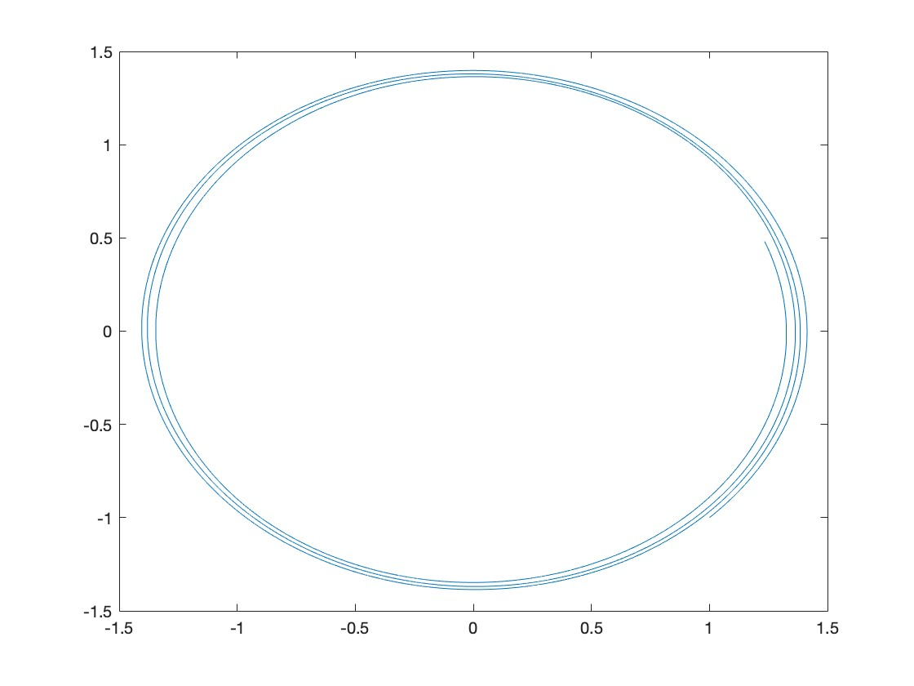

# Molecular-Dynamics

A simple molecular-dynamics simulation in Rust, using the Lennard-Jones potential for particle interactions. Particles are also confined within a Box, which also emits a Lennard-Jones potential. There is also a simple implementation of a harmonic oscillator centered at the origin. This `Rust` code only generates the data in `csv` format, analyzing can be done with whatever tool desired.

## Cases

All cases bellow are inside [the cases folder](./src/cases/)

### Simple

The `simple` simulation considers the particles are in a vacuum confined by walls.

Example with 100 particles:


Other example:


### In medium

The `medium` simulation considers the particles inside a medium. The medium has a defined temperature and viscosity. Viscosity drags the particles and the temperature modulates random fluctuations which can move the particles.

The following example is with one particle at a distance from walls where they have no effect on it. Because of the high temperature, random fluctuations will push the particle out of equilibirum and into the Lennard-Jones potentials of the walls:


### Harmonic Oscillator

The `harmonic` simulation considers a simple harmonic oscillator potential at the origin. This simulation was analyzed with Matlab, with [this code](./analysis/harmonic.m).




## Video plots

Video plots were made with Matlab. The idea behind this Rust code is to generate and save the data in `csv` format. The data can then be analyzed by other better suited languages, like `Matlab`.

The video plots shown above were made with this [Matlab code](./analysis/sim.m) inside the `analysis` folder.

## How to run

1. Download code.
2. Adapt sims to your needs
3. Build it and run it (I suggest doing it in release mode):

```
cargo build --release
cargo run --release
```

When data is saved to the `data` folder, you can plot it and analyze it however you want!
